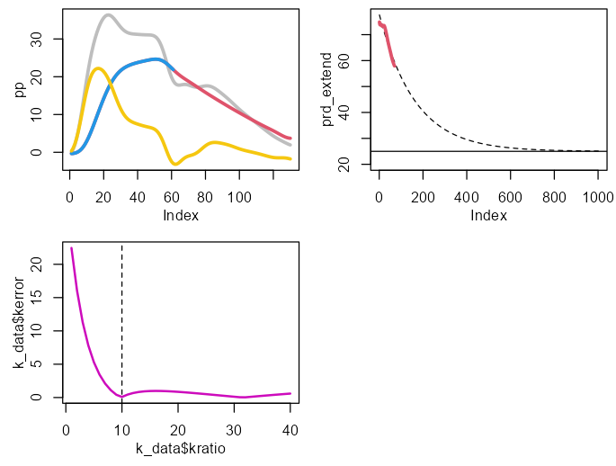
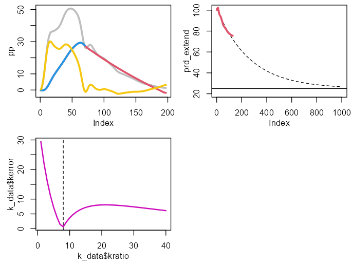

# Reservoir Pressure in R
Reservoir excess pressure analysis in R

This R script includes functions for calculating reservoir pressure variables from pressure waveforms measured continuously over one cardiac cycle.

Diastolic pressure (dicrotic notch to end) is fit with an exponential with a fixed asymptote of 25 mmHg (per Kottenburg-Assenmacher 2009 & Schipke 2003). The systolic component of the reservoir pressure is estimated by finding continuity with fitted diastolic pressure at the dicrotic notch. Note that these calculations differ slightly from the original calculations from K. Parker & A. Hughes.

